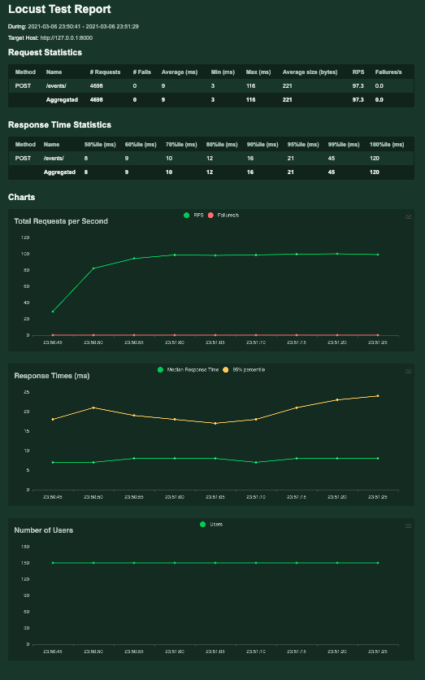

# Code challenge - The eye

## Objective
The objective of this code challenge can be found inside [the-eye.md](the-eye.md)

## Assumptions
- May CRUD operations could be used to Event
- Since there is not a lot of information about the Application and Session. I didn't represent them on my models
- Assuming the communication between the Application and the eye will be over HTTPS and from a frontend application, if not a OAuth2 could be used for safety
- To assure the applications request are not going to hanging receive and put it in a queue would be the most reliable choice, which would also help with race condition
- `select_for_update` just work for big databases like Postgres, MySQL. So I'm assuming one of them would be used for this application instead of sqlite3
- Assuming all the tests(including load test) are running in a CI/CD pipeline
- Assuming the load tests with Locust are going to run against a product like environment to have real numbers

## Decisions
- Keep the solution as simples as possible.
- I let the hints Arrange, Act and Assert on tests to show how I structure my tests. 
- Explicit is better than implicit. 
- I'm using [Black](https://black.readthedocs.io/en/stable/) for code formatting.
- Python 3.9.2 is been used for this code, the latest available at the moment.

## Folder structure
the main folders are core(django project) and the_eye(django app).
```
.
├── Makefile
├── Pipfile
├── Pipfile.lock
├── README.md
├── TODO.md
├── core
│   ├── core
│   │   ├── __init__.py
│   │   ├── asgi.py
│   │   ├── settings.py
│   │   ├── urls.py
│   │   └── wsgi.py
│   ├── db.sqlite3
│   ├── manage.py
│   └── the_eye
│       ├── __init__.py
│       ├── admin.py
│       ├── apps.py
│       ├── migrations
│       │   ├── 0001_initial.py
│       │   └── __init__.py
│       ├── models.py
│       ├── serializers.py
│       ├── tests
│       │   ├── __init__.py
│       │   ├── models_tests.py
│       │   └── views_tests.py
│       └── views.py
├── pytest.ini
└── the-eye.md
```
## Requirements
- Pipenv
- Python3
- make

## Loadtest with [Locust](https://locust.io/)

[Loadtest output](core/the_eye/tests/load_test_report.html) run against django test server:
```
(consume-affairs) ➜  consume-affairs git:(master) ✗ locust -f core/the_eye/tests/loadtest.py
[2021-03-06 23:50:34,990] MacBook-Pro.local/INFO/locust.main: Starting web interface at http://0.0.0.0:8089 (accepting connections from all network interfaces)
[2021-03-06 23:50:34,996] MacBook-Pro.local/INFO/locust.main: Starting Locust 1.4.3
[2021-03-06 23:50:41,377] MacBook-Pro.local/INFO/locust.runners: Spawning 150 users at the rate 50 users/s (0 users already running)...
[2021-03-06 23:50:44,579] MacBook-Pro.local/INFO/locust.runners: All users spawned: WebsiteUser: 150 (150 total running)
[2021-03-06 23:51:29,656] MacBook-Pro.local/INFO/locust.runners: Stopping 150 users
[2021-03-06 23:51:29,662] MacBook-Pro.local/INFO/locust.runners: 150 Users have been stopped, 0 still running
KeyboardInterrupt
2021-03-07T02:52:18Z
[2021-03-06 23:52:18,485] MacBook-Pro.local/INFO/locust.main: Running teardowns...
[2021-03-06 23:52:18,485] MacBook-Pro.local/INFO/locust.main: Shutting down (exit code 0), bye.
[2021-03-06 23:52:18,485] MacBook-Pro.local/INFO/locust.main: Cleaning up runner...
 Name                                                          # reqs      # fails  |     Avg     Min     Max  Median  |   req/s failures/s
--------------------------------------------------------------------------------------------------------------------------------------------
 POST /events/                                                   4698     0(0.00%)  |       9       3     116       8  |   97.35    0.00
--------------------------------------------------------------------------------------------------------------------------------------------
 Aggregated                                                      4698     0(0.00%)  |       9       3     116       8  |   97.35    0.00

Response time percentiles (approximated)
 Type     Name                                                              50%    66%    75%    80%    90%    95%    98%    99%  99.9% 99.99%   100% # reqs
--------|------------------------------------------------------------|---------|------|------|------|------|------|------|------|------|------|------|------|
 POST     /events/                                                            8      9     11     12     16     21     33     45     95    120    120   4698
--------|------------------------------------------------------------|---------|------|------|------|------|------|------|------|------|------|------|------|
 None     Aggregated                                                          8      9     11     12     16     21     33     45     95    120    120   4698

(consume-affairs) ➜  consume-affairs git:(master) ✗

```



## Setup
To setup the project just have the requirements and run:
```
make setup
```
Expected output:
```
➜  test-setup git:(master) ✗ make setup
pipenv install --dev
Creating a virtualenv for this project...
Pipfile: /Users/felipe.morais/dev/python/test-setup/Pipfile
Using /Users/felipe.morais/.pyenv/versions/3.9.1/bin/python3.9 (3.9.1) to create virtualenv...
⠴ Creating virtual environment...created virtual environment CPython3.9.1.final.0-64 in 306ms
  creator CPython3Posix(dest=/Users/felipe.morais/.local/share/virtualenvs/test-setup-I2hdndE-, clear=False, global=False)
  seeder FromAppData(download=False, pip=bundle, setuptools=bundle, wheel=bundle, via=copy, app_data_dir=/Users/felipe.morais/Library/Application Support/virtualenv)
    added seed packages: pip==21.0.1, setuptools==53.0.0, wheel==0.36.2
  activators BashActivator,CShellActivator,FishActivator,PowerShellActivator,PythonActivator,XonshActivator

✔ Successfully created virtual environment!
Virtualenv location: /Users/felipe.morais/.local/share/virtualenvs/test-setup-I2hdndE-
Installing dependencies from Pipfile.lock (d7db11)...
  🐍   ▉▉▉▉▉▉▉▉▉▉▉▉▉▉▉▉▉▉▉▉▉▉▉▉▉▉▉▉▉▉▉▉ 47/47 — 00:00:19
To activate this project's virtualenv, run pipenv shell.
Alternatively, run a command inside the virtualenv with pipenv run.
pipenv shell
Launching subshell in virtual environment...
 . /Users/felipe.morais/.local/share/virtualenvs/test-setup-I2hdndE-/bin/activate
➜  test-setup git:(master) ✗  . /Users/felipe.morais/.local/share/virtualenvs/test-setup-I2hdndE-/bin/activate
(test-setup) ➜  test-setup git:(master) ✗

```


## Tests
To run the tests uses:
```
make tests
```

Expected output:
```

(test-setup) ➜  test-setup git:(master) ✗ make test
pushd core &&\
	pytest &&\
	popd
~/dev/python/test-setup/core ~/dev/python/test-setup
==================================================================================================================== test session starts ====================================================================================================================
platform darwin -- Python 3.9.1, pytest-6.2.2, py-1.10.0, pluggy-0.13.1 -- /Users/felipe.morais/.local/share/virtualenvs/test-setup-I2hdndE-/bin/python
cachedir: .pytest_cache
django: settings: core.settings (from ini)
rootdir: /Users/felipe.morais/dev/python/test-setup, configfile: pytest.ini
plugins: cov-2.11.1, django-4.1.0
collected 2 items

the_eye/tests.py::EventTests::test_create_event PASSED                                                                                                                                                                                                [ 50%]
the_eye/tests.py::ModelTestCase::test_model_can_create_an_event PASSED                                                                                                                                                                                [100%]

---------- coverage: platform darwin, python 3.9.1-final-0 -----------
Name                                 Stmts   Miss  Cover   Missing
------------------------------------------------------------------
the_eye/__init__.py                      0      0   100%
the_eye/admin.py                         1      0   100%
the_eye/migrations/0001_initial.py       6      0   100%
the_eye/migrations/__init__.py           0      0   100%
the_eye/models.py                        9      0   100%
the_eye/serializers.py                   6      0   100%
the_eye/tests.py                        21      0   100%
the_eye/views.py                         7      0   100%
------------------------------------------------------------------
TOTAL                                   50      0   100%


==================================================================================================================== slowest 5 durations ====================================================================================================================
0.31s setup    core/the_eye/tests.py::EventTests::test_create_event
0.16s call     core/the_eye/tests.py::EventTests::test_create_event
0.03s call     core/the_eye/tests.py::ModelTestCase::test_model_can_create_an_event
0.00s teardown core/the_eye/tests.py::ModelTestCase::test_model_can_create_an_event
0.00s setup    core/the_eye/tests.py::ModelTestCase::test_model_can_create_an_event
=============================================================================================================== 2 passed, 1 warning in 0.92s ================================================================================================================
~/dev/python/test-setup
(test-setup) ➜  test-setup git:(master) ✗

```


## Run
To run the code use:
```
make run
```
Expected output:
```

(test-setup) ➜  test-setup git:(master) ✗ make run
python core/manage.py runserver
Watching for file changes with StatReloader
Performing system checks...

System check identified no issues (0 silenced).

You have 19 unapplied migration(s). Your project may not work properly until you apply the migrations for app(s): admin, auth, contenttypes, sessions, the_eye.
Run 'python manage.py migrate' to apply them.
March 07, 2021 - 01:18:06
Django version 3.1.7, using settings 'core.settings'
Starting development server at http://127.0.0.1:8000/
Quit the server with CONTROL-C.

```
